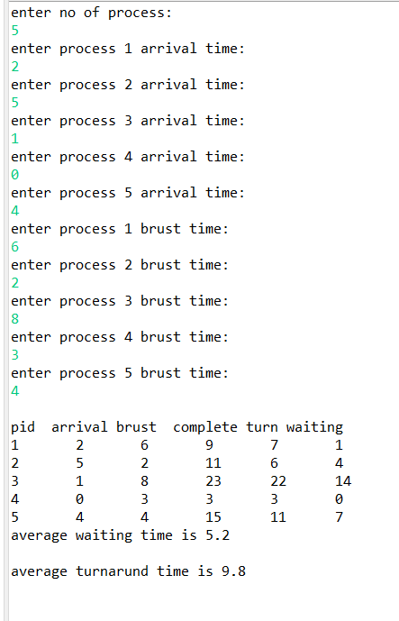
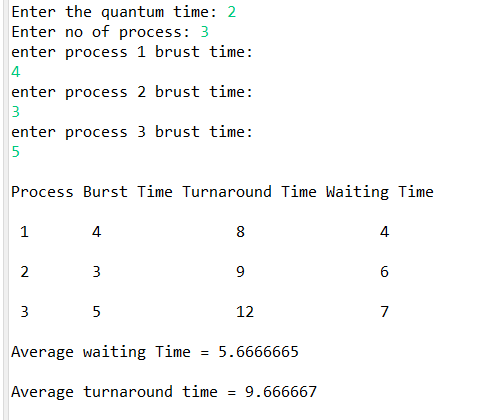
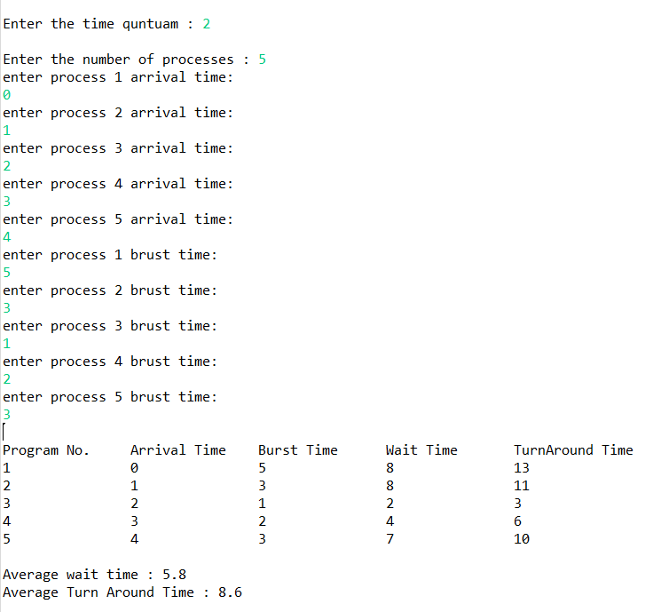

# operating-systems-
## SJF
Shortest job first depends on the average running time of the processes. The accurate estimates of these measures help in the implementation of the shortest job first in an environment, which otherwise makes the same nearly impossible to implement. This is because often the execution burst of processes does not happen beforehand. It can be used in interactive environments where past patterns are available to determine the average time between the waiting time and the commands. Although it is disadvantageous to use the shortest-job-first concept in short-term CPU scheduling, it is considered highly advantageous in long-term CPU scheduling. Moreover, the throughput is high in the case of shortest job first.

https://github.com/Amlkassem/operating-systems-/tree/main/SJF

## RoundRobin
Round-robin scheduling allocates each task an equal share of the CPU time. In its simplest form, tasks are in a circular queue and when a task's allocated CPU time expires, the task is put to the end of the queue and the new task is taken from the front of the queue. Round-robin scheduling is not very satisfactory in many real-time applications where each task can have varying amounts of CPU requirements depending upon the complexity of processing required. One variation of the pure round-robin scheduling is to provide priority-based scheduling, where tasks with the same priority levels receive equal amounts of CPU time.

## RoundRobin Without Arrival Time 

https://github.com/Amlkassem/operating-systems-/tree/main/RRwithoutArrivalTime

## RoundRobin with Arrival Time 

https://github.com/Amlkassem/operating-systems-/tree/main/RRwithArrivalTime

